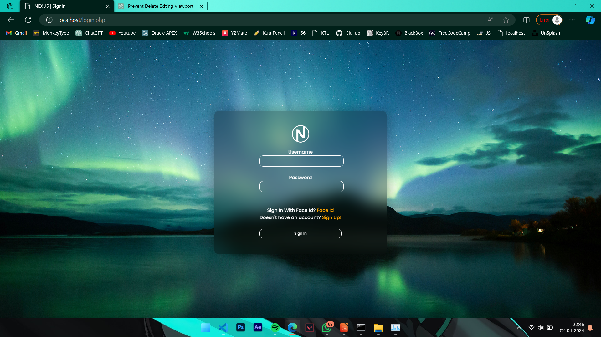
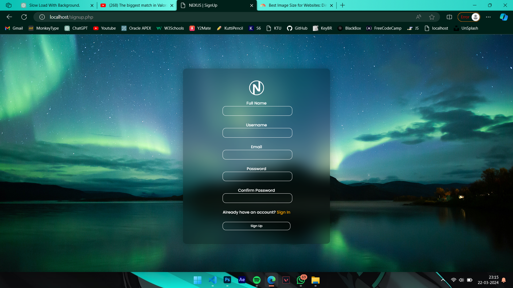
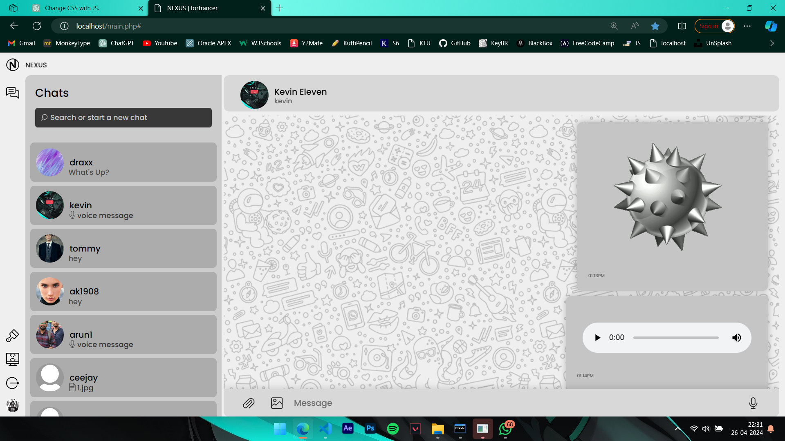
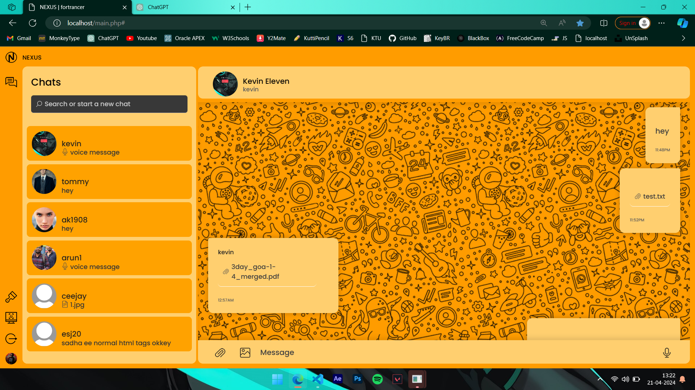

# Nexus: Real-Time Online Chatting Platform

Nexus is an online chatting platform developed using PHP, MySQL, and Python for face authentication. It offers real-time private messaging, customizable themes, and message translation capabilities.

## Features

- **Real-Time Private Messaging**: Engage in instant private conversations with other users.
- **Secure Face Authentication**: Enhance security with Python-based face recognition.
- **Customizable Themes**: Personalize your chat interface with customizable themes.
- **Message Translation**: Translate messages for seamless communication across languages.

## Screenshots

### Chat Screen


### Login



### Signup



### Different Themes

#### Radiance Theme



#### Citrus Theme



## Getting Started

Follow these steps to get Nexus up and running on your local machine:

1. **Prerequisites**:
   - Apache web server
   - PHP
   - MySQL
   - Python (including `face_recognition` module)

2. **Clone the Repository**:
   ```bash
   git clone https://github.com/for-trancer/NEXUS.git
   cd NEXUS
