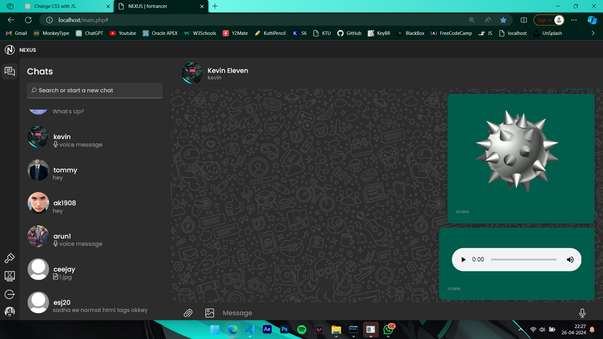

# Nexus: Real-Time Online Chatting Platform

Nexus is an online chatting platform developed using PHP, MySQL, and Python for face authentication. It offers real-time private messaging, customizable themes, and message translation capabilities.

## Features

- **Real-Time Private Messaging**: Engage in instant private conversations with other users.
- **Secure Face Authentication**: Enhance security with Python-based face recognition.
- **Customizable Themes**: Personalize your chat interface with customizable themes.
- **Message Translation**: Translate messages for seamless communication across languages using google translator.

## Screenshots
Include **screenshots** or **images** to give users a visual preview of The **NEXUS UI**

### Chat Screen
Experience real-time conversations with Nexus's intuitive **chat interface**. Engage in private messaging, customize themes, and translate messages seamlessly across languages.



### Login
Securely access Nexus with our user-friendly **login interface**. Enter your credentials to start chatting securely and privately.


### Signup
Join Nexus today! Sign up and **create your account** to connect with friends and colleagues through our real-time messaging platform.


### Different Themes

#### Radiance Theme
Brighten up your Nexus experience with the **Radiance theme**. Enjoy a vibrant and energetic chat interface designed to lift your spirits.


#### Citrus Theme
Add a refreshing twist to your chats with the **Citrus theme**. Embrace the lively colors and cheerful design for a lively chatting experience.


## Getting Started

Follow these steps to get Nexus up and running on your local machine:

1. **Prerequisites**:
   - Apache web server
   - PHP
   - MySQL
   - Python (including `face_recognition` module)

2. **Clone the Repository**:
   ```bash
   git clone https://github.com/for-trancer/NEXUS.git
   cd NEXUS
3. **Database Setup**:

   - Create a MySQL database using the [schema.sql](schema.sql)
   - Import the provided SQL schema into the mysql to create the database and tables.
   ```shell
   source path-to schema.sql
   ```

4. **Configuration**:

   - Update the database connection settings in `config.php` to match your local database setup.

5. **Run the Application**:

   Start your web server and open the NEXUS application in your web browser.

## Built With

- PHP - Backend server scripting language.
- AJAX - Asynchronous JavaScript for real-time updates.
- MySQL - Database management system.
- HTML/CSS - Frontend structure and styling.
- Python - Face Authentication
- Google Translator API - For Message Translation

## Contributing

Please read [CONTRIBUTING.md](CONTRIBUTING.md) for details on our code of conduct, and the process for submitting pull requests to us.

## License

This project is licensed under the MIT License - see the [LICENSE.md](LICENSE.md) file for details.

## Acknowledgments

- Special thanks to ChatGPT for their contributions to the project.
